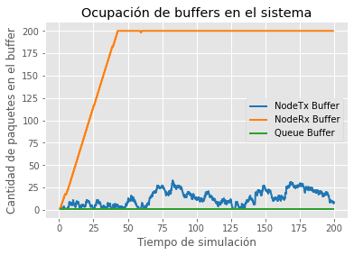
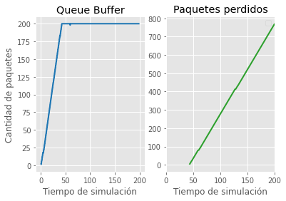
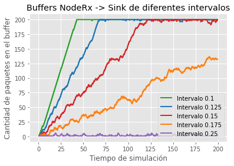
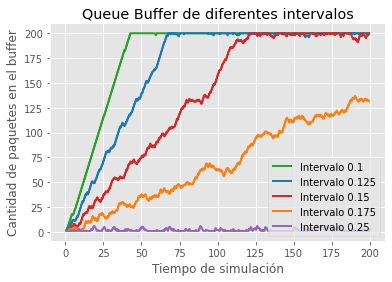
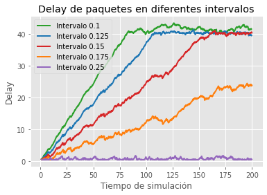
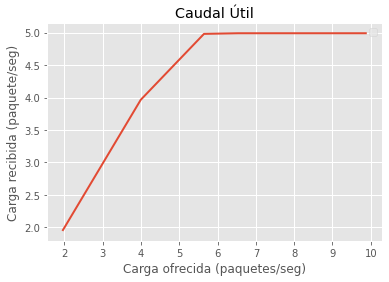

# INFORME

# TITULO

## Resumen
En este trabajo se analizarán distintas simulaciones de un modelo de cola. Se buscará ver como diferentes variables afectan el funcionamiento de la red, además de implementar un algoritmo de control de flujo y congestión. 
(TODO: RESULTADOS)

## Introduccion 
Se denonima congestión al fenomeno que ocurre cuando, por distintas razones, a una red (o nodo) le está llegando mas datos de los que puede manejar. Por otro lado nos referimos a control de flujo al proceso de administrar la tasa de transmisión de datos entre un emisor y un receptor.

Para el analisis se creó una red sencilla compuesta de un generador, una cola y un destino. Se definen ademas cuantos paquetes por segundo se pueden enviar y el tiempo de demora. 

Creamos un nodo llamado nodeTx que contiene un generador y un buffer. El generador se encarga de crear y enviar paquetes; esto lo hace en intervalos aleatorios segun una distribución exponencial de parametro 'lambda', los almacena en su buffer en caso de no poder enviarlos.

La cola intermedia recibe mensajes desde el nodeTx y los envia al nodeRx a ser consumidos, en caso de no poder cuenta con un buffer.

Por su parte el nodo nodeRx cuenta con un destino y su buffer. Se encarga de consumir los paquetes a medida que los va recibiendo y usa el buffer para ir encolando los siguientes.  

Planteamos dos casos de estudio:
* Caso de estudio 1: La velocidad de transmisión desde el nodeTx al queue es de 1 Mbps, luego desde la queue al nodeRx es de 1 Mbps y consume el paquete a 0,5 Mbps.
* Caso de estudio 2: La velocidad de transmisión desde el nodeTx al queue es de 1 Mbps, luego desde la queue al nodeRx es de 0,5 Mbps y consume el paquete a 1 Mbps.

Y para cada caso probamos diferentes 'lambdas' para variar el tiempo de generación de paquetes.

Para poder visualizar las situaciones que pasarian usamos simulaciones discretas con la herramienta Omnet++, de esas visualizaciones sacamos los siguientes datos en base al tiempo de simulación:
* Paquetes enviados
* Paquetes recibidos
* Paquetes descartados
* Delay de cada paquete
* Cantidad de paquetes en buffers

En ambos casos vimos que se pierden una importante cantidad de paquetes, debido a saturaciónes en distintos buffers según el caso. En el caso 1 se satura el buffer de nodeRx (receptor) mientras que en el caso 2 se satura el buffer de Queue (la red). 

Aca vemos que como se llenan los buffers según el caso:
  
  
| Caso 1 |  Caso 2 |

En las siguientes imagenes vemos que cuando se llena el buffer empiezan a perderse paquetes:
  
 
| Caso 1 |  Caso 2 |

Vemos que como hay un cuello de botella por reducir a la mitad la velocidad en una parte, distinta según el caso, provoca que a larga se pierdan la mitad de los paquetes enviados. Esto se ve en los siguientes gráficos:
  
 
| Caso 1 |  Caso 2 |

En ambos casos, si aumentamos el lambda, sucede que empieza a ver menos perdida de paquetes ya que se envían menos paquetes por segundo. Hasta que no se pierden paquetes aunque haya problemas de flujo y/o congestión debido a que se envían cada bastante tiempo, dandole la posibilidad de que todos los paquetes lleguen al receptor.  
 
   
| Caso 1 |  Caso 2 |

Todo lo anterior lo podemos ver en el delay (retardo) de ambos casos, donde se observa que cuando se empieza a saturar algún buffer provoca un aumento del delay de los paquetes.
  
   
| Caso 1 |  Caso 2 |

Por último, aunque lo que provoca la perdida de paquetes y aumento de delays en los dos casos de estudio son cosas diferentes, vemos que afectan de la misma forma, por eso la similud en lo gráficos de cada caso. En los siguiente gráficos se ven claramente, ya que los paquetes recibidos y envíados por segundo en las diferentes simulaciones cambiandos los valores del lamda para la generación de paquetes dan el mismo gráfico para ambos casos de estudio.

 

En conclusión, la diferencia entre el caso de estudio 1 y 2 es en donde sucede la saturación. En el caso 1 sucede en el buffer del NodeRx por lo tanto sucede en el receptor, lo que implica que es un problema de flujo. Mientras que en el caso 2 sucede en el buffer de la Queue por lo tanto sucede en la red, lo que implica que es un problema de congestión. Y para solucionar cada problema necesitamos sistemas de control de flujo y control de congestión que buscan evitar/solucionar los respectivos problemas mencionados de cada caso.

Y en las siguientes secciones vamos a dar nuestro aporte para solucionar estos problemas, dando un control de flujo que se encargue de que el receptor no sea saturado, y un control de congestión para evitar saturar la red.

## Métodos
