# INFORME

# Solución de control de congestión y flujo mediante la implementación de algoritmos 

## Resumen
En este trabajo se analizaron distintas simulaciones en OMNeT++ de un modelo de cola. Se analizó como diferentes variables afectan el funcionamiento de la red, además se implementaron y estudiaron algoritmos de control de flujo y congestión. 

## Introduccion 
Se denonima congestión al fenomeno que ocurre cuando, por distintas razones, a una red (o nodo) le está llegando mas datos de los que puede manejar. Por otro lado nos referimos a control de flujo al proceso de administrar la tasa de transmisión de datos entre un emisor y un receptor.

Para el analisis se creó una red sencilla compuesta de un generador, una cola y un destino. Se definen ademas cuantos paquetes por segundo se pueden enviar y el tiempo de demora. 

Se creó un nodo llamado nodeTx que contiene un generador y un buffer. El generador se encarga de crear y enviar paquetes; esto lo hace en intervalos aleatorios segun una distribución exponencial de parametro 'lambda', los almacena en su buffer en caso de no poder enviarlos.

La cola intermedia recibe mensajes desde el nodeTx y los envia al nodeRx a ser consumidos, en caso de no poder cuenta con un buffer.

Por su parte el nodo nodeRx cuenta con un destino y su buffer. Se encarga de consumir los paquetes a medida que los va recibiendo y usa el buffer para ir encolando los siguientes.  

Planteamos dos casos de estudio:

* Caso de estudio 1: La velocidad de transmisión desde el nodeTx al queue es de 1 Mbps, luego desde la queue al nodeRx es de 1 Mbps y consume el paquete a 0,5 Mbps.

* Caso de estudio 2: La velocidad de transmisión desde el nodeTx al queue es de 1 Mbps, luego desde la queue al nodeRx es de 0,5 Mbps y consume el paquete a 1 Mbps.

Y para cada caso probamos diferentes 'lambdas' para variar el tiempo de generación de paquetes.

Para poder visualizar las situaciones que pasarian usamos simulaciones discretas con la herramienta Omnet++, de esas visualizaciones sacamos los siguientes datos en base al tiempo de simulación:

* Paquetes enviados

* Paquetes recibidos

* Paquetes descartados

* Delay de cada paquete

* Cantidad de paquetes en buffers

En ambos casos vimos que se pierden una importante cantidad de paquetes, debido a saturaciónes en distintos buffers según el caso. En el caso 1 se satura el buffer de nodeRx (receptor) mientras que en el caso 2 se satura el buffer de Queue (la red). 

Aca vemos que como se llenan los buffers según el caso:

(Tener en cuenta que las imagenes de la izquierda siempre van a representar el caso de estudio 1 mientras que la de la derecha el caso de estudio 2)

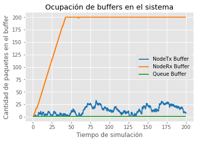  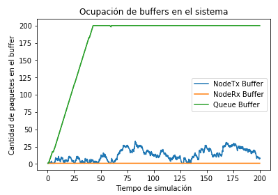  

En las siguientes imagenes vemos que cuando se llena el buffer empiezan a perderse paquetes:

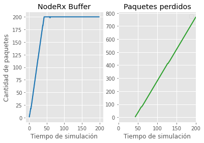  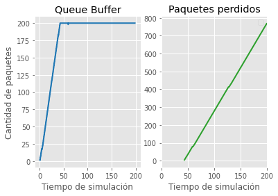

Vemos que como hay un cuello de botella por reducir a la mitad la velocidad en una parte, distinta según el caso, provoca que a larga se pierdan la mitad de los paquetes enviados. Esto se ve en los siguientes gráficos:

   

En ambos casos, si aumentamos el lambda, sucede que empieza a ver menos perdida de paquetes ya que se envían menos paquetes por segundo. Hasta que no se pierden paquetes aunque haya problemas de flujo y/o congestión debido a que se envían cada bastante tiempo, dandole la posibilidad de que todos los paquetes lleguen al receptor.  

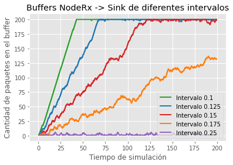 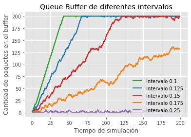

Todo lo anterior lo podemos ver en el delay (retardo) de ambos casos, donde se observa que cuando se empieza a saturar algún buffer provoca un aumento del delay de los paquetes.

     

Por último, aunque lo que provoca la perdida de paquetes y aumento de delays en los dos casos de estudio son cosas diferentes, vemos que afectan de la misma forma, por eso la similud en lo gráficos de cada caso. En los siguiente gráficos se ven claramente, ya que los paquetes recibidos y envíados por segundo en las diferentes simulaciones cambiandos los valores del lamda para la generación de paquetes dan el mismo gráfico para ambos casos de estudio.

 

En conclusión, la diferencia entre el caso de estudio 1 y 2 es en donde sucede la saturación. En el caso 1 sucede en el buffer del NodeRx por lo tanto sucede en el receptor, lo que implica que es un problema de flujo. Mientras que en el caso 2 sucede en el buffer de la Queue por lo tanto sucede en la red, lo que implica que es un problema de congestión. Y para solucionar cada problema necesitamos sistemas de control de flujo y control de congestión que buscan evitar/solucionar los respectivos problemas mencionados de cada caso.

Y en las siguientes secciones vamos a dar nuestro aporte para solucionar estos problemas, dando un control de flujo que se encargue de que el receptor no sea saturado, y un control de congestión para evitar saturar la red.

## Métodos

  Para solucionar el problema de la perdidad de paquetes se modificó la red agregando un nodo de comunicación entre el nodo generador y el nodo receptor. Esto nos permite enviar paquetes `Feedback` para informar sobre las condiciones de los buffers de cada nodo. A partir de esto definimos 2 algoritmos.

  El primero consiste en aumentar `serviceTime` cuando es necesario para simular una aumento de demora en la transmisión de paquetes, esto lo hace cuando algún buffer, ya sea de la red (Queue) o del receptor, se encuentra a una cierta capacidad. 

  Mientras en el segundo se envia un paquete solo cuando se confirma que el anterior ha sido recibido.

 ### Implementación

Para la implementación del primer algoritmo se definió el `FeedBackPacket` donde se le agregó el entero `IncrementServiceTime` que indica en cuanto se multiplica el serviceTime del paquete. En el nodo *TransportTx* si llega un mensaje del tipo Feedback, reemplaza el valor de su variable interna incrementServiceTime por el valor indicado por IncrementServiceTime del paquete Feedback. En *TransportRx* también tiene su variable incrementServiceTime y cada tanta cantidad de paquetes recibidos, si el buffer tiene mas de la mitad de su capacidad ocupada, manda un mensaje de Feedback incrementando en uno el multiplicador. En caso de que el buffer tenga más de la mitad de su capacidad libre y el incrementServiceTime es mayor que 1, se reduce el multiplicador en uno. *TransportRx* también puede recibir mensajes del tipo Feedback provenientes de *Queue1* si el valor del multiplicador es mayor al de *TransportRx* se reenvia el paquete a *TransportTx* y si es menor el paquete es eliminado. *Queue1* tiene un funcionamiento similar, solo que no recibe mensajes del tipo Feedback.

El segundo está inspiradado en el algoritmo de `Parada y Espera` donde el transmisor envía un paquete y espera la confirmación, en forma de paquete Feedback, de que este ha sido recibido por *TransportRx* para enviar el siguiente.

## Resultados 

### Primer algoritmo

El algoritmo propuesto soluciona tanto el problema de control de flujo como el de control de congestión. Podemos ver en los siguientes gráficos como los buffers de las partes intervinientes nunca llegan a su limite, por lo cual no se perdieron paquetes 

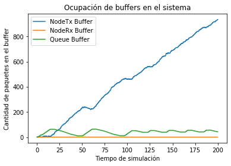
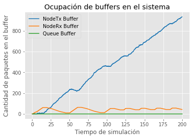

Comparando los resultados del primer analisis podemos ver que la cantidad de paquetes enviados y recibidos es la misma para cada caso, como muestran los siguientes graficos

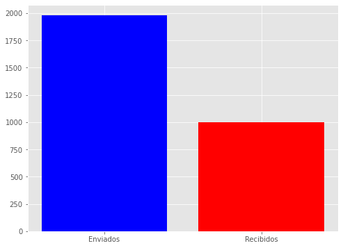

Esto se da porque se aumenta el tiempo que demora el transmisor en enviar un paquete, por lo tanto es el buffer del transmisor el que se va llenando, evitando la perdida de los paquetes. 

Los siguientes gráficos muestran la cantidad de paquetes en el buffer de *TransportRx* y *Queue1* (según el caso) para distintos valores de lambda.

Se puede observar como en ningún caso el buffer de interés se alcanza a llenar.

Por último podemos ver que en ambos casos obtuvimos el mismo caudal útil que en el primer analisis.

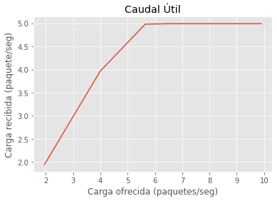

En conclusión se envía y se recibe la misma cantidad de paquetes que en el primer apartado de analisis, pero sin perdida de paquetes.

### Segundo algoritmo

Este algoritmo también soluciona ambos problemas. Se puede observar en los siguientes gráficos como los buffers nunca llegan a su limite.

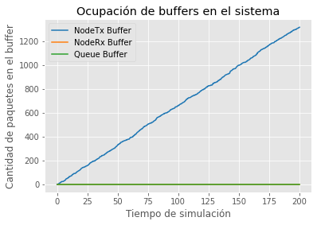
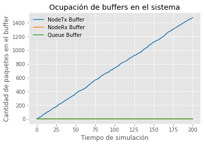

En el siguiente gráfico se ve como se tiene una menor cantidad de paquetes recibidos en comparación al primer analisis.

Esto es por la espera que se da entre que se envía un paquete y se recibe la confirmación

A continuación, el gráfico de la ocupación de los buffers considerados, para diferentes valores de lambda.

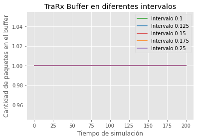
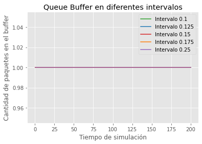

Se puede observar que para todo valor de lambda tenemos un paquete en el buffer, esto se da porque se envia un paquete y solo cuando se haya confirmado la llegada del anterior.

Por último el gráfico del caudal útil para cada caso.

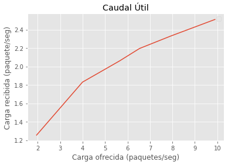

A comparación del primer algoritmo se tiene un menor caudal útil, esto dado también por el tiempo que existe entre paquete enviado y su confirmación.

## Discusión

Se logró implementar distintos algoritmos que solucionan la congestión y el control de flujo. Los dos algoritmos asume que el tamaño del buffer del nodo generador es "infito", es decir que nunca puede ser llenado. Además no consideramos el caso de que por alguna razón se pierda un paquete, en el caso del segundo algoritmo se puede implementar un temporizador que depués de una cierta canditad de tiempo si no se recibió la confimación del paquete enviado, lo reenvia; esto introduce problemas de paquetes duplicados que requiere de un algoritmo mas completo.

## Referencias

- Tanembaum. Computer Networks: Fifth Edition

- OMNeT++ Simulation Manual Version 6.x
